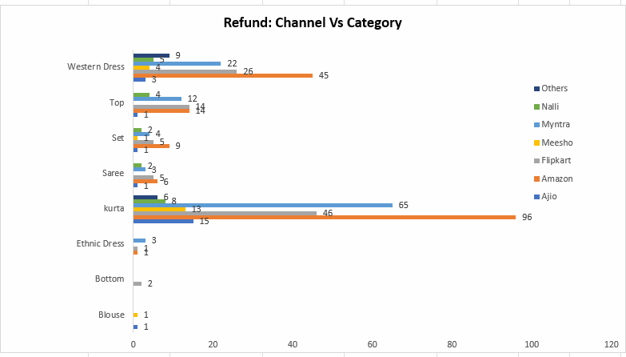

# 📊 Store Annual Report 2025 - Excel Business Insights 

## Interactive Excel Dashboard analyzing store sales, customer behavior, refunds, and channel performance using Pivot Tables and Business Analytics.

---

## 📌 Project Overview

This project is an **end-to-end Excel Sales Dashboard** built to analyze store performance, customer behavior, sales trends, refund patterns, and order status using raw transactional data from an e-commerce store.

I used **Excel Pivot Tables**, **Pivot Charts**, **Data Cleaning**, and **Business Analytics** techniques to transform raw data into meaningful business insights for better decision-making.

---
### Main Dashboard

---

### Key Insights Panel

---

## 🛠 Tools & Skills Used

- Microsoft Excel (Advanced)
- Pivot Tables & Pivot Charts
- Data Cleaning & Preparation
- Dashboard Design & Layout
- Data Visualization
- Conditional Formatting
- Business Analytics
- KPI Tracking
- Business Insight

---

## 📂 Dataset Information

The dataset includes 25+ columns with the following key fields:

| Column Name | Description | Data Type |
|-------------|-------------|-----------|
| Order ID | Unique order identifier | Text |
| Cust ID | Unique customer identifier | Number |
| Gender | Customer gender | Text |
| Age | Customer age | Number |
| Age Group | Categorized age (Teenager, Adult, Senior Citizen) | Text |
| Date | Purchase date | Date |
| Month | Extracted month | Text |
| Status | Order status (Delivered, Cancelled, Returned) | Text |
| Channel | Sales platform | Text |
| SKU | Product SKU code | Text |
| Category | Product category | Text |
| Size | Product size | Text |
| Qty | Quantity ordered | Number |
| Amount | Total order value (INR) | Number |
| ship-city | Delivery city | Text |

**Sample Data:**
| Order ID | Gender | Age | Status | Channel | Category | Amount |
|----------|--------|-----|--------|---------|----------|--------|
| 171-102931-3038738 | Women | 44 | Delivered | Amazon | Kurti | 376 |
| 405-2183842-2225946 | Women | 29 | Delivered | Ajio | Set | 1449 |
| 419-1879468-6745940 | Men | 24 | Delivered | Flipkart | Western | 1743 |

---

## 🔧 Data Cleaning & Preparation

Before building the dashboard, I performed extensive data cleaning:

✅ **Standardized Gender Values** - Corrected inconsistent entries  
✅ **Created Age Groups** - Categorized into Teenager (13-19), Adult (20-49), Senior Citizen (50+)  
✅ **Formatted Dates** - Extracted months for time-series analysis  
✅ **Removed Duplicates** - Ensured data integrity  
✅ **Standardized Categories** - Unified product categories  
✅ **Handled Missing Values** - Cleaned incomplete records  
✅ **Created Calculated Columns** - Added derived metrics for analysis

---

## 📊 Dashboard Components & Analysis

### 1. 📈 Orders vs Sales Trend (Monthly)

**Visualization:** Line Chart with Dual Axes

**Key Findings:**
- **Peak Sales:** March shows highest sales volume
- **Gradual Decline:** Sales declined progressively from August onwards
- **Order Volume:** Mirrors sales pattern with slight variations
- **Seasonal Pattern:** Q1 (Jan-Mar) shows strongest performance

**Business Insight:** Plan inventory and marketing budgets around seasonal peaks. Consider promotional campaigns to boost sales during low-performing months (Sep-Dec).

---

### 2. 👥 Orders: Men vs Women

**Visualization:** Donut Chart

**Key Findings:**
- **Women Customers:** Contribute ~64% of total orders
- **Men Customers:** Represent ~36% of total orders
- **Gender Gap:** Women significantly outnumber men in purchases

**Business Insight:** Focus marketing efforts on women's products. Develop targeted campaigns for men to balance the gender gap.

---

### 3. 📦 Orders vs Status

**Visualization:** Donut Chart

**Key Findings:**
- **Delivered:** ~92% successful delivery rate
- **Cancelled:** ~4% order cancellation
- **Returned:** ~4% return rate

**Business Insight:** High delivery success rate indicates efficient operations. Investigate cancellation and return reasons to improve customer satisfaction.

---

### 4. 🔄 Refund Analysis: Channel vs Category

**Visualization:** Stacked Column Chart

**Breakdown by Category:**
| Category | Refund Count |
|----------|--------------|
| Western Dress | 45 |
| Top | 14 |
| Set | 9 |
| Kurti | 96 |
| Ethnic Dress | 15 |
| Bottom | 1 |
| Blouse | 2 |
| Saree | 6 |

**Breakdown by Channel:**
| Channel | Refund Count |
|---------|--------------|
| Amazon | 96 |
| Flipkart | 45 |
| Myntra | 14 |
| Ajio | 15 |
| Meesho | 1 |

**Business Insight:** Kurti has the highest refund rate across all channels. Amazon processes the most refunds. Investigate quality issues with Kurti products and improve product descriptions.

---

## 📈 Key Insights Summary

### 🎯 Customer Demographics
- **Gender:** Women contribute ~65% of orders
- **Age Group:** Adult customers (30-49 yrs) contribute ~50%
- **Top Age Segment:** Adults are the major customer segment

### 🌍 Geographic Performance
**Top Performing States:**
1. Maharashtra (Highest sales)
2. Karnataka
3. Uttar Pradesh
4. Telangana
5. Tamil Nadu

These 5 states contribute ~35% of total sales.

### 🛒 Channel Performance
**Top Channels:**
1. Amazon - Largest contributor
2. Flipkart
3. Myntra

**Combined Contribution:** ~80% of total sales through Amazon, Flipkart, and Myntra

### 📦 Operational Metrics
- **Delivery Success:** 92%
- **Order Cancellation:** 4%
- **Return Rate:** 4%
- **Peak Season:** Q1 (Jan-Mar)
- **Low Season:** Q4 (Oct-Dec)

---

## 💼 Business Recommendations

### 🎯 Target Audience
**Primary Segment:** Women aged 30-49 years in Maharashtra, Karnataka, and Uttar Pradesh

**Strategy:**
- Create gender-specific marketing campaigns
- Design age-appropriate product collections
- Localize promotions for top-performing states

### 🛒 Channel Strategy
**Focus Channels:** Amazon, Flipkart, Myntra

**Actions:**
- Increase advertising spend on these platforms
- Offer exclusive discounts on these channels
- Optimize product listings for better visibility
- Run platform-specific promotional campaigns

### 📈 Growth Opportunities
1. **Product Development:** Focus on high-demand categories (Kurti, Western Dress)
2. **Quality Improvement:** Address refund issues in Kurti category
3. **Market Expansion:** Target underperforming states
4. **Customer Retention:** Implement loyalty programs
5. **Seasonal Campaigns:** Boost sales during low-performing months

### ⚙️ Operational Improvements
- Investigate cancellation reasons
- Improve product descriptions to reduce returns
- Monitor refund patterns by category
- Optimize delivery logistics in top states

---

## 🎯 Project Achievements

- ✅ Cleaned and transformed raw transactional data
- ✅ Built an interactive Excel dashboard with 4+ visualizations
- ✅ Generated actionable business insights
- ✅ Analyzed customer demographics and behavior
- ✅ Tracked sales trends and seasonal patterns
- ✅ Performed detailed refund and channel analysis
- ✅ Created KPI tracking dashboard
- ✅ Provided strategic business recommendations

---

## 💡 What I Learned

Through this project, I improved my skills in:

- **Excel Dashboard Development** - Designing professional dashboards
- **Data Cleaning & Preparation** - Handling real-world data challenges
- **Pivot Table Analysis** - Advanced Excel analytics
- **Business Storytelling** - Translating data into insights
- **Data Visualization** - Creating effective charts and graphs
- **Business Analytics** - Generating actionable recommendations
- **KPI Design** - Tracking and monitoring key metrics
- **Decision Making** - Data-driven business strategy

---

## 🚀 Future Improvements

### Short-term Enhancements
- Add **Slicers** for dynamic filtering (by channel, category, state)
- Implement **Conditional Formatting** for KPI tracking
- Create **Executive Summary** dashboard
- Add **Year-over-Year (YoY)** comparison
- Include **Forecasting** models

### Long-term Plans
- Migrate to **Power BI** for advanced analytics
- Automate **Dashboard Refresh** with Power Query
- Build **Predictive Models** for sales forecasting
- Create **Interactive Maps** for geographic analysis
- Implement **Real-time Data** integration
- Add **Drill-down** capabilities
- Develop **Mobile-responsive** dashboard

---

